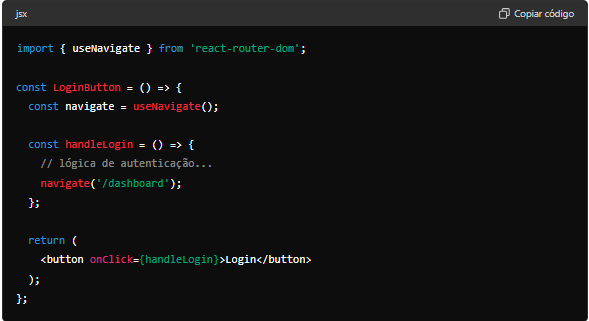

# ABOUT READ.ME

1. Write with markdown language. See the link bellow.
2. Respect the section separation

**_Markdowndoc_**: https://www.markdownguide.org/basic-syntax/

# HOW TO RUN A MOCK API WITH JSON SERVER

**_Link documentation_**: https://www.freecodecamp.org/news/json-server-for-frontend-development/

### Step #1 - Install JSON Server

 `npm install -g json-server`

### Step #2 - Create a JSON File

 ex:  db.json

### Step #3 - Create Data

    * Each key will be an entitiy
    * follow the patttern:
      	{
            "entity1": [
                {
                    "id": 1,
                    "key": value,
                }
            ],
            "entity2": [
                {
                    "id": 1,
                    "key": value,
                }
            ],
        }

### Step #4 - Start the Server

`json-server --watch db.json`

This will run on "https://localhost:3000"

if you need to change the port  pass the flag --port

`json-server --watch db.json --port 8000`

# HOW TO RUN THE APP

* This is a Vite + React + TS code
* Clone or download the repository
* Go to \app folder
* Run the comand:  `npm install`
* Then still at the app folder, on terminal run  `npm run dev`


# CODE STRUCTURE

* The style is defined by CSS by component
* In order to exercise different functionalities of the React Lib, to navegate between routing pages, two implement forms was applied using objects of the 'react-router-dom':
  * **component Link**

    `import { Link } from'react-router-dom';`

    ```
    Mainly in JSX to wrap elements like anchors (<a>), buttons or any other clickable element

    Link Advantages:

    Creation of navigation links declaratively.
    Prevents reloading the entire page, only updating the content of the specified route.
    Makes it easier to style common links in web applications.
    ```
  * **Hook useNavegate**

    `import { useNavigate } from'react-router-dom';`

    ```
    Hook introduced in React Router v6, It returns a function that can be called to navigate to a specific route, similar to React Router v5's useHistory

    useNavigate Advantages:

    Easy-to-use programmatic navigation, especially within functions or hooks.
    Useful for cases where navigation is logic-based, such as after an asynchronous operation (for example, after login is successful).
    ```

    
